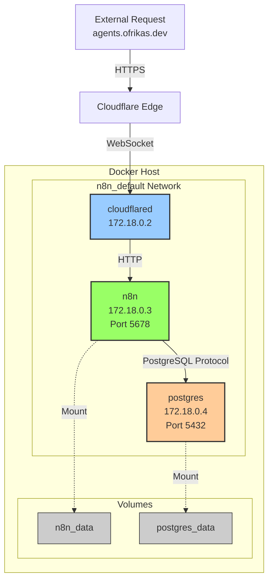

# Docker Network Architecture

Docker networking setup for the n8n stack.

## Network Topology

```
Docker Host (LXC Container 100)
IP: 10.100.102.15

┌────────────────────────────────────────────────────────────┐
│                    Docker Daemon                           │
│                                                            │
│  ┌──────────────────────────────────────────────────────┐ │
│  │        Bridge Network: n8n_default                   │ │
│  │        Subnet: 172.18.0.0/16 (auto-assigned)        │ │
│  │                                                      │ │
│  │   ┌─────────────────────────────────────────────┐   │ │
│  │   │  Container: cloudflared                     │   │ │
│  │   │  IP: 172.18.0.2                             │   │ │
│  │   │  Purpose: Cloudflare Tunnel client          │   │ │
│  │   │  Exposed Ports: None                        │   │ │
│  │   │  Volumes: None                              │   │ │
│  │   │  ┌─────────────────────────────────┐        │   │ │
│  │   │  │ Connects to:                    │        │   │ │
│  │   │  │  • Cloudflare Edge (outbound)   │        │   │ │
│  │   │  │  • n8n:5678 (internal)          │        │   │ │
│  │   │  └─────────────────────────────────┘        │   │ │
│  │   └─────────────────────────────────────────────┘   │ │
│  │                                                      │ │
│  │   ┌─────────────────────────────────────────────┐   │ │
│  │   │  Container: n8n                             │   │ │
│  │   │  IP: 172.18.0.3                             │   │ │
│  │   │  Purpose: Workflow automation               │   │ │
│  │   │  Exposed Ports: 5678:5678                   │   │ │
│  │   │  Volumes: n8n_data:/home/node/.n8n          │   │ │
│  │   │  ┌─────────────────────────────────┐        │   │ │
│  │   │  │ Depends on:                     │        │   │ │
│  │   │  │  • postgres (healthy)           │        │   │ │
│  │   │  │ Receives from:                  │        │   │ │
│  │   │  │  • cloudflared (HTTP)           │        │   │ │
│  │   │  │ Connects to:                    │        │   │ │
│  │   │  │  • postgres:5432 (DB queries)   │        │   │ │
│  │   │  └─────────────────────────────────┘        │   │ │
│  │   └─────────────────────────────────────────────┘   │ │
│  │                                                      │ │
│  │   ┌─────────────────────────────────────────────┐   │ │
│  │   │  Container: n8n_postgres                    │   │ │
│  │   │  IP: 172.18.0.4                             │   │ │
│  │   │  Purpose: PostgreSQL 18 database            │   │ │
│  │   │  Exposed Ports: None (internal only)        │   │ │
│  │   │  Volumes: postgres_data:/var/lib/postgresql │   │ │
│  │   │  ┌─────────────────────────────────┐        │   │ │
│  │   │  │ Healthcheck:                    │        │   │ │
│  │   │  │  pg_isready every 10s           │        │   │ │
│  │   │  │ Serves:                         │        │   │ │
│  │   │  │  • n8n (workflow data)          │        │   │ │
│  │   │  │  • n8n (credentials, encrypted) │        │   │ │
│  │   │  │  • n8n (execution history)      │        │   │ │
│  │   │  └─────────────────────────────────┘        │   │ │
│  │   └─────────────────────────────────────────────┘   │ │
│  │                                                      │ │
│  └──────────────────────────────────────────────────────┘ │
│                                                            │
│  Docker Volumes (persistent storage)                      │
│  ┌─────────────────┐  ┌──────────────────────┐           │
│  │  n8n_data       │  │  postgres_data       │           │
│  │  Workflows      │  │  Database files      │           │
│  │  Settings       │  │  User/credential     │           │
│  │  Binary data    │  │  Execution history   │           │
│  └─────────────────┘  └──────────────────────┘           │
└────────────────────────────────────────────────────────────┘
```

## Mermaid Diagram



## Communication Patterns

### External → n8n (Webhook)

```
User Request
  ↓
Cloudflare Edge
  ↓
cloudflared (receives)
  ↓
HTTP request to http://n8n:5678/webhook/...
  ↓
n8n processes webhook
  ↓
Response back through cloudflared → Cloudflare
```

### n8n → PostgreSQL (Data)

```
n8n needs to store/retrieve data
  ↓
Connect to postgres:5432
  ↓
PostgreSQL protocol (SQL queries)
  ↓
postgres container responds
  ↓
n8n receives data
```

### Container Name Resolution

Docker's internal DNS automatically resolves container names:
- `postgres` → `172.18.0.4`
- `n8n` → `172.18.0.3`
- `cloudflared` → `172.18.0.2`

## Network Isolation

### What CAN communicate:

✅ Containers on `n8n_default` network can talk to each other  
✅ `cloudflared` can reach `n8n:5678`  
✅ `n8n` can reach `postgres:5432`  
✅ All containers can reach the internet (outbound)

### What CANNOT communicate:

❌ Containers on different networks  
❌ External direct access to `postgres:5432` (no exposed port)  
❌ Direct access to containers without going through tunnel

## Port Mapping

| Container | Internal Port | External Port | Accessible From |
|-----------|---------------|---------------|-----------------|
| cloudflared | N/A | None | Only Docker network |
| n8n | 5678 | 5678 (mapped) | LXC host: 10.100.102.15:5678 |
| postgres | 5432 | None | Only Docker network |

**Note:** Even though n8n exposes port 5678 to the host, it's NOT accessible from the internet. Only the Cloudflare Tunnel can reach it.

## Network Commands Reference

```bash
# List all Docker networks
docker network ls

# Inspect the n8n network
docker network inspect n8n_default

# See which containers are on the network
docker network inspect n8n_default | grep -A 5 "Containers"

# Connect a new container to the network
docker run --network n8n_default ...

# See container IPs
docker inspect -f '{{.Name}} - {{range .NetworkSettings.Networks}}{{.IPAddress}}{{end}}' $(docker ps -q)
```

## Environment Variables Flow

```
.env file
  ↓
Docker Compose reads environment
  ↓
Passes to containers as ENV vars
  ↓
n8n reads: DB_POSTGRESDB_HOST=postgres
             DB_POSTGRESDB_PORT=5432
             N8N_ENCRYPTION_KEY=...
  ↓
postgres reads: POSTGRES_PASSWORD=...
                POSTGRES_USER=n8n
                POSTGRES_DB=n8n
```

## Volume Management

### n8n_data Volume Contents

```
/home/node/.n8n/
  ├── config/          # n8n configuration
  ├── workflows/       # Workflow JSON files
  ├── credentials/     # Encrypted credentials
  └── database.sqlite  # (NOT USED - using PostgreSQL instead)
```

### postgres_data Volume Contents

```
/var/lib/postgresql/
  ├── 18/              # PostgreSQL version directory
  │   └── main/        # Database cluster
  │       ├── base/    # Database files
  │       ├── pg_wal/  # Write-ahead logs
  │       └── ...
  └── ...
```

## Security Considerations

1. **Network Isolation:** PostgreSQL is NOT exposed outside Docker network
2. **Encryption:** n8n credentials encrypted with `N8N_ENCRYPTION_KEY`
3. **Tunnel Authentication:** cloudflared authenticates with token
4. **Database Passwords:** Strong random passwords in `.env` (not in Git!)
5. **Volume Persistence:** Data survives container restarts/recreations

## Troubleshooting

```bash
# Check if containers can ping each other
docker exec n8n ping postgres
docker exec n8n ping cloudflared

# Test n8n connection from cloudflared
docker exec cloudflared curl http://n8n:5678

# Check PostgreSQL connection from n8n
docker exec n8n nc -zv postgres 5432

# View container IPs
docker inspect n8n | grep IPAddress
```
