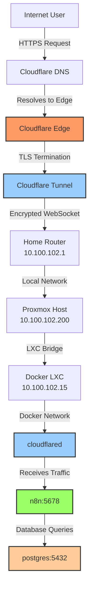

# Network Architecture

Complete network architecture of the homelab from Internet to services.

## ASCII Diagram

```
┌─────────────────────────────────────────────────────────────┐
│                         INTERNET                            │
│                   (Public DNS Queries)                      │
└────────────────────────┬────────────────────────────────────┘
                         │
                         ▼
┌─────────────────────────────────────────────────────────────┐
│                    Cloudflare DNS                           │
│  Nameservers: amelie.ns.cloudflare.com                     │
│               calvin.ns.cloudflare.com                      │
│  Records: agents.ofrikas.dev → Cloudflare Tunnel           │
└────────────────────────┬────────────────────────────────────┘
                         │
                         ▼
┌─────────────────────────────────────────────────────────────┐
│              Cloudflare Edge (TLS Termination)              │
│  • SSL/TLS certificates (auto-renewed)                     │
│  • DDoS protection                                          │
│  • CDN caching                                              │
│  • WAF (Web Application Firewall)                          │
└────────────────────────┬────────────────────────────────────┘
                         │
                         │ Encrypted WebSocket (outbound only!)
                         ▼
┌─────────────────────────────────────────────────────────────┐
│                     Home Network                            │
│  Router: 10.100.102.1                                       │
│  Subnet: 10.100.102.0/24                                    │
│  • No port forwarding needed!                               │
│  • No exposed public IP!                                    │
└────────────────────────┬────────────────────────────────────┘
                         │
                         ▼
┌─────────────────────────────────────────────────────────────┐
│                  Proxmox VE Host                            │
│  IP: 10.100.102.200                                         │
│  OS: Proxmox VE 8.x                                         │
│  Web UI: https://10.100.102.200:8006                        │
└────────────────────────┬────────────────────────────────────┘
                         │
                         ▼
┌─────────────────────────────────────────────────────────────┐
│                LXC Container 100 (Docker)                   │
│  IP: 10.100.102.15                                          │
│  OS: Debian                                                 │
│  Docker: 29.1.4                                             │
│  ┌────────────────────────────────────────────────────────┐ │
│  │         Docker Network: n8n_default                    │ │
│  │                                                        │ │
│  │  ┌──────────────┐  ┌──────────────┐  ┌──────────────┐│ │
│  │  │ cloudflared  │  │     n8n      │  │  postgres    ││ │
│  │  │              │  │              │  │              ││ │
│  │  │ Outbound to  │  │  Port: 5678  │  │  Port: 5432  ││ │
│  │  │  Cloudflare  │  │              │  │              ││ │
│  │  │              │  │  Workflows   │  │  Database    ││ │
│  │  │              │  │  Automation  │  │              ││ │
│  │  └──────────────┘  └──────────────┘  └──────────────┘│ │
│  │                                                        │ │
│  └────────────────────────────────────────────────────────┘ │
└─────────────────────────────────────────────────────────────┘
```

## Mermaid Diagram



## Traffic Flow

### Inbound Request (User → n8n)

1. **User** requests `https://agents.ofrikas.dev`
2. **DNS Lookup** → Cloudflare nameservers return Cloudflare Edge IP
3. **Cloudflare Edge** receives HTTPS request, terminates TLS
4. **Cloudflare Tunnel** routes traffic through existing WebSocket connection
5. **cloudflared container** receives decrypted request on Docker network
6. **n8n container** receives HTTP request on `http://n8n:5678`
7. **n8n** processes webhook, may query PostgreSQL
8. **Response** flows back through the same path

### Outbound Connection (cloudflared → Cloudflare)

1. **cloudflared** initiates outbound WebSocket to Cloudflare Edge
2. **Cloudflare** authenticates using tunnel token
3. **Persistent connection** maintained (heartbeat every 30s)
4. **No inbound ports** needed on home router!

## Security Layers

| Layer | Component | Protection |
|-------|-----------|------------|
| Edge | Cloudflare | DDoS, WAF, rate limiting |
| Transport | Tunnel | Encrypted WebSocket, no exposed IP |
| Network | Home Router | NAT, default deny inbound |
| Host | Proxmox | Firewall, local network only |
| Container | Docker | Network isolation, least privilege |
| Application | n8n | Authentication, webhook validation |

## Network Segments

```
Public Internet
  └─ Cloudflare Edge (anycast IPs)

Home Network (10.100.102.0/24)
  ├─ Router (10.100.102.1)
  ├─ Proxmox (10.100.102.200)
  └─ Docker LXC (10.100.102.15)
      └─ Docker Network (172.18.0.0/16 internal)
          ├─ cloudflared (172.18.0.2)
          ├─ n8n (172.18.0.3)
          └─ postgres (172.18.0.4)
```

## DNS Resolution Path

```
User types "agents.ofrikas.dev"
  ↓
Browser queries local DNS
  ↓
Local DNS queries root servers (.)
  ↓
Root servers return .dev TLD servers
  ↓
.dev servers return nameservers for ofrikas.dev
  ↓
Cloudflare nameservers return Cloudflare Edge IP
  ↓
Browser connects to Cloudflare Edge
  ↓
Cloudflare routes to tunnel → n8n
```

## Key Advantages

✅ **No Port Forwarding** — Router stays secure, no inbound rules  
✅ **Hidden IP** — Home IP never exposed to the internet  
✅ **Free SSL** — Cloudflare handles certificates automatically  
✅ **DDoS Protection** — Cloudflare absorbs attacks  
✅ **Simple Setup** — Just run a container, no complex configs  
✅ **Dynamic IP Friendly** — IP changes don't break anything  
