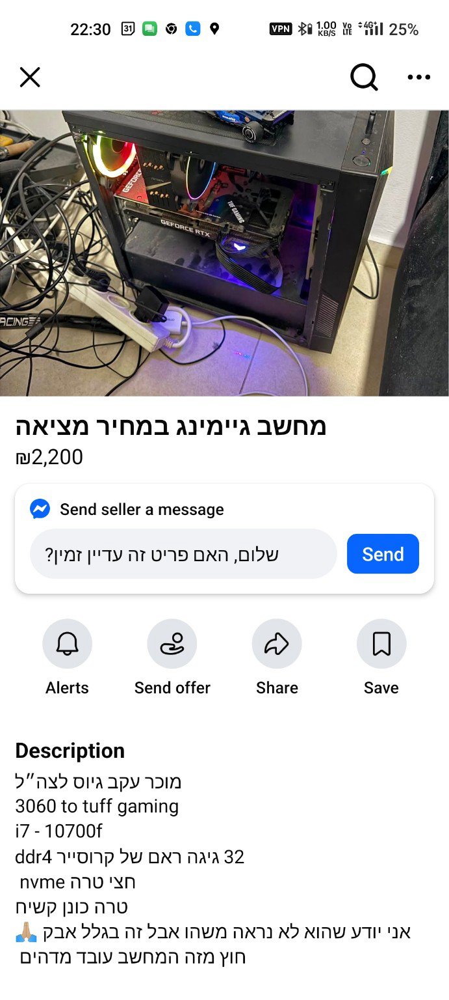
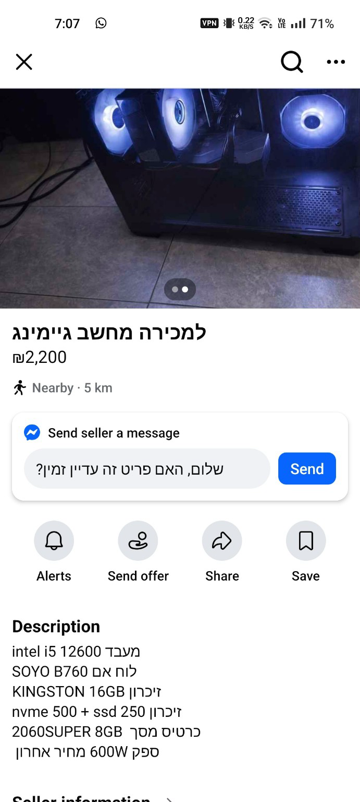
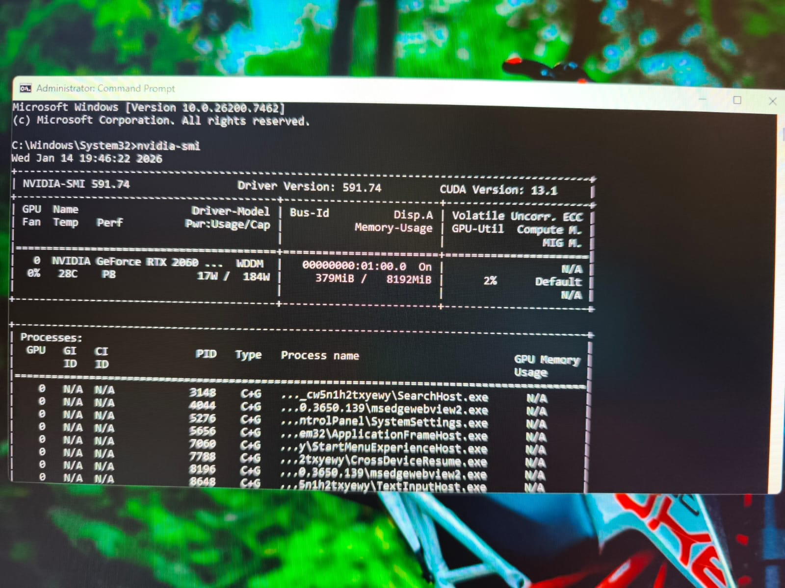
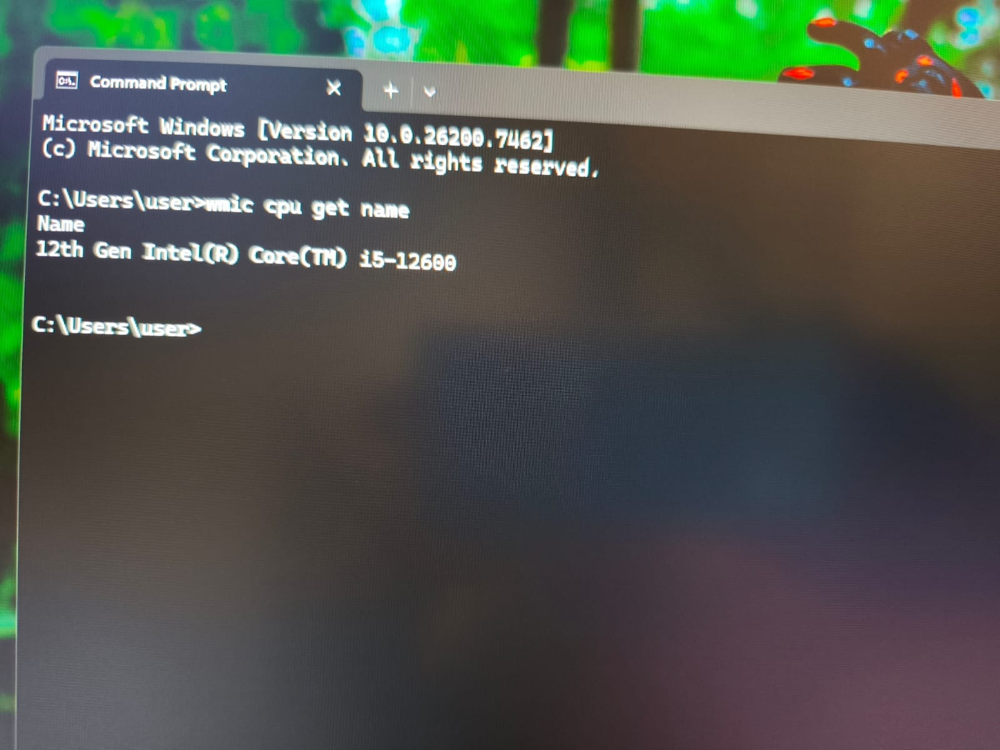
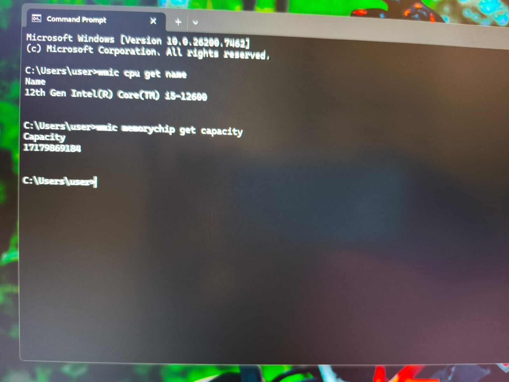
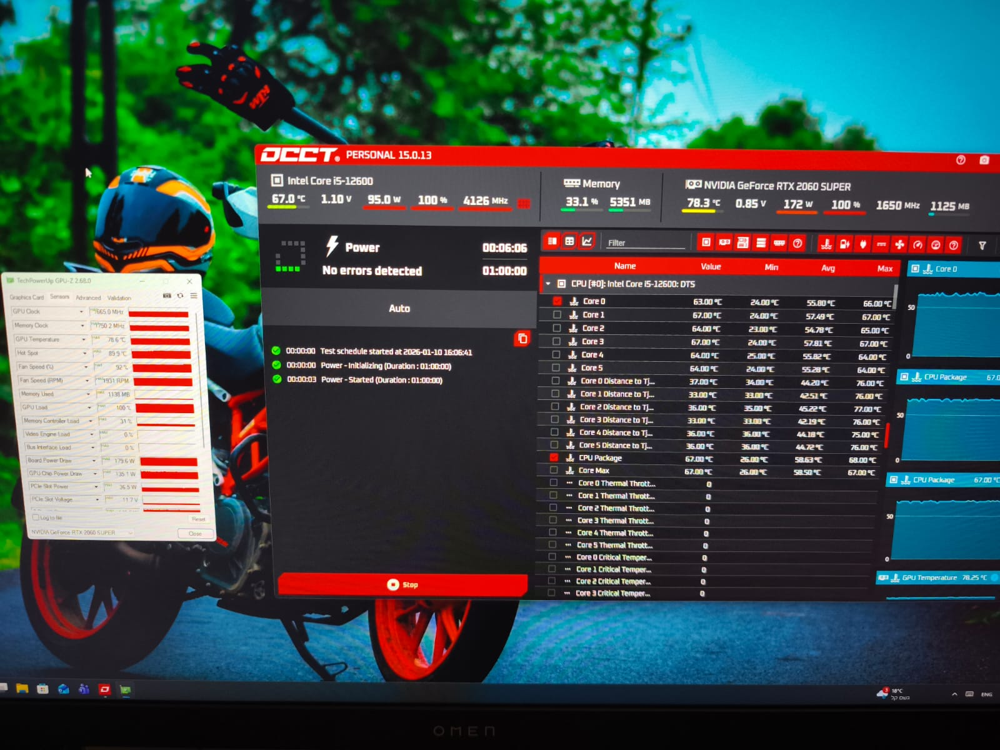

This chapter documents the first stage of my home lab project:  
**choosing, validating, and purchasing the hardware**.

The goal of this project is to build a reliable home server that can grow over time and support:
- n8n (workflow automation)
- PostgreSQL
- Grafana
- Docker-based services
- RAG / lightweight AI workloads (future phase)

This README focuses **only on the hardware decision process** and explains:
- What options were considered
- Why some options were rejected
- Cost considerations
- The final hardware choice and justification

---

## Project Goals

Before choosing hardware, the requirements were defined clearly:

### Functional Requirements
- 24/7 stability
- Good multi-core CPU performance
- Ability to run containers (Docker)
- Support for virtualization
- Optional GPU support for future AI / RAG workloads

### Non-Functional Requirements
- Quiet enough for home use
- Reasonable power consumption
- Cost-effective (used hardware allowed)
- Hardware that can grow with the project

---

## Hardware Options Considered

### 1. Cloud (AWS EC2)

**Pros**
- No hardware maintenance
- Easy public access
- Scales instantly

**Cons**
- Monthly recurring cost (~$60–100/month)
- GPU instances are very expensive
- Less learning about real hardware
- Easy to overspend unintentionally

**Conclusion:**  
Rejected. Great for production, not ideal for a learning-focused home project.

---

### 2. Old Enterprise / Appliance Hardware

Examples:
- Firewall appliances
- Forensic workstations
- Old server racks

**Pros**
- Sometimes very cheap
- Designed for reliability

**Cons**
- Very noisy
- High power consumption
- Locked-down BIOS / limited flexibility
- Often obsolete CPUs and DDR3 memory

**Conclusion:**  
Rejected. Too much compromise and not suitable for modern workloads.

---

### 3. Mini PCs (NUC / GMKtec / similar)

**Pros**
- Quiet
- Low power consumption
- Modern CPUs
- Easy to place at home

**Cons**
- No GPU expandability
- Limited RAM expansion
- Less flexibility long-term

**Conclusion:**  
Good option, but rejected due to limited future AI/GPU growth.

---

### 4. Older Desktop PCs (i7-7700 / i5-9400 class)

**Pros**
- Cheap
- Easy to maintain
- Quiet enough

**Cons**
- Limited CPU headroom
- No efficient future growth
- Not ideal for AI workloads

**Conclusion:**  
Acceptable as a temporary solution, but not ideal for a long-term project.

---

### 5. Modern Desktop with Dedicated GPU (Final Direction)

**Pros**
- Modern CPU architecture
- Dedicated NVIDIA GPU (CUDA support)
- Excellent Proxmox & Docker compatibility
- Upgradeable RAM and storage
- One-time cost

**Cons**
- Higher upfront cost
- Requires basic hardware validation

**Conclusion:**  
Selected as the best balance between cost, performance, learning value, and future growth.

---

## Final Hardware Configuration (Selected)

### CPU
- **Intel Core i5-12600 (12th Gen)**
- 10 cores (6 Performance + 4 Efficient)
- 16 threads
- Excellent single-core and multi-core performance
- Ideal for containerized workloads

### GPU
- **NVIDIA GeForce RTX 2060 SUPER**
- 8GB VRAM
- CUDA and Tensor Core support
- Suitable for:
  - RAG
  - Embeddings
  - Local inference
  - Future AI experiments

### Memory
- **16GB DDR4 (2667 MT/s)**
- Single stick (upgradeable to 32GB)
- Enough for initial deployment
- Planned upgrade path

### Storage
- **NVMe SSD ~500GB** (OS, Docker, Databases)
- **SATA SSD ~250GB** (data / backups)
- Total usable space ~700GB

### Motherboard
- **B760 chipset**
- Full UEFI support
- Virtualization enabled
- Modern platform with upgrade options

### Power Supply
- 600W PSU
- Sufficient for current configuration
- Passed real stress testing

---

## Validation & Testing

Before wiping Windows and installing Proxmox, the system was validated using:

- BIOS / UEFI inspection
- CPU identification
- RAM capacity verification
- Disk detection
- GPU validation via `nvidia-smi`
- Combined CPU + GPU stress testing (OCCT)
- Temperature and stability checks

All tests passed successfully.

---

## The Purchase Journey

Finding the right used hardware took time and patience. I browsed local listings, compared prices, and validated several options.
After several searches, I found a seller with exactly what I needed:



**Specs:**
- Ryzen 5 3600 – 6 cores / 12 threads  
- RTX 2060 Super 8GB  
- 16GB RAM DDR4 3600  
- NVMe 256GB  
- B450 motherboard  
- Antec case  
- **Price: 2,200 ILS**


### The Hardware Arrives

Here's what I got:



---

## Pre-Installation Validation

Before buying, I asked the seller to run some tests to ensure everything worked correctly.

### CPU Verification

```cmd
wmic cpu get name
```



✅ Confirmed: Ryzen 5 3600 detected correctly.

### RAM Verification

```cmd
wmic memorychip get capacity
```



✅ Confirmed: 16GB RAM installed and recognized.

### System Info

```cmd
systeminfo | findstr /C:"Processor" /C:"Total Physical Memory"
```



✅ All specs matched the listing perfectly.

### Stress Testing

stress tests to ensure stability under load:



**Results:**
- ✅ CPU stable under full load
- ✅ GPU performing correctly  
- ✅ Temperatures within safe range
- ✅ No crashes or artifacts

All tests passed successfully!

---

## Cost Summary

| Component Category | Notes |
|-------------------|-------|
| Full System | Purchased used from local seller |
| Total Cost | **2,200 ILS (~$600 USD)** |
| Monthly Cost | **$0** (one-time purchase) |
| Upgrade Path | RAM → 32GB, storage expansion, newer GPU possible |

Compared to cloud hosting (~$60–100/month), this hardware pays for itself in **3–4 months** and then runs essentially cost-free (except electricity).

---

## Why This Hardware Was Chosen

This system provides:
- Strong learning value
- Real-world hardware experience
- Modern Proxmox compatibility
- Docker-first design
- AI-ready foundation
- No vendor lock-in
- No recurring fees

It is powerful enough **now**, and flexible enough **later**.

---

## Next Steps

The next chapter will cover:
- Proxmox VE installation
- BIOS configuration for virtualization
- Network configuration and troubleshooting
- Post-install optimization
- Setting up LXC containers

**Continue to:** [Chapter 1: Proxmox Install and Network Hell](01-proxmox-install-and-network-hell.md)

---

**Total Time:** ~2 weeks of research  
**Difficulty:** ⭐⭐☆☆☆