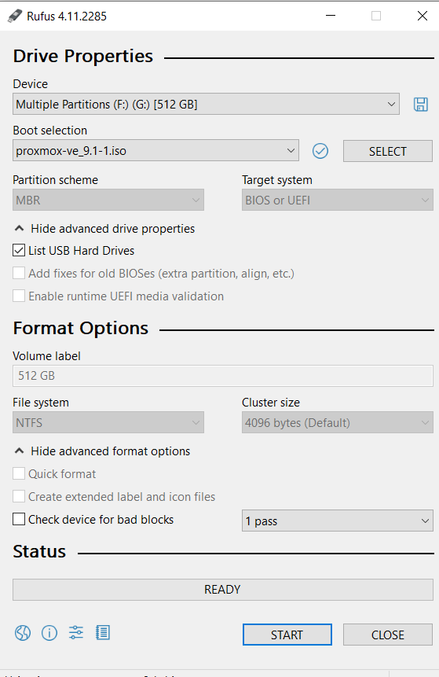
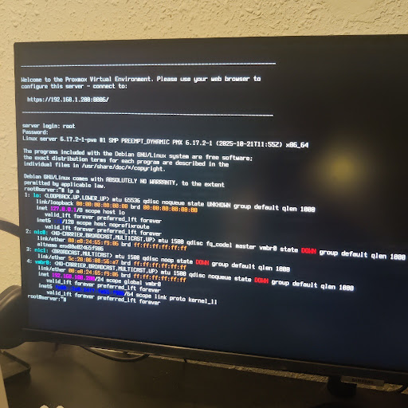
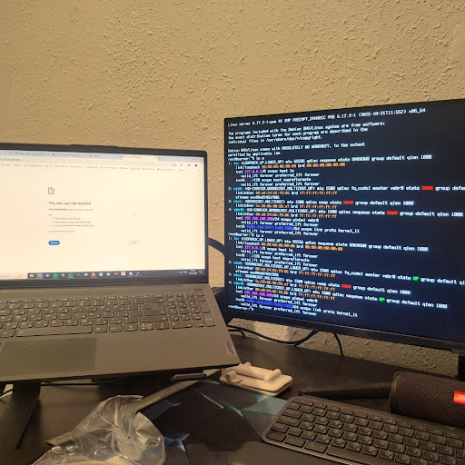
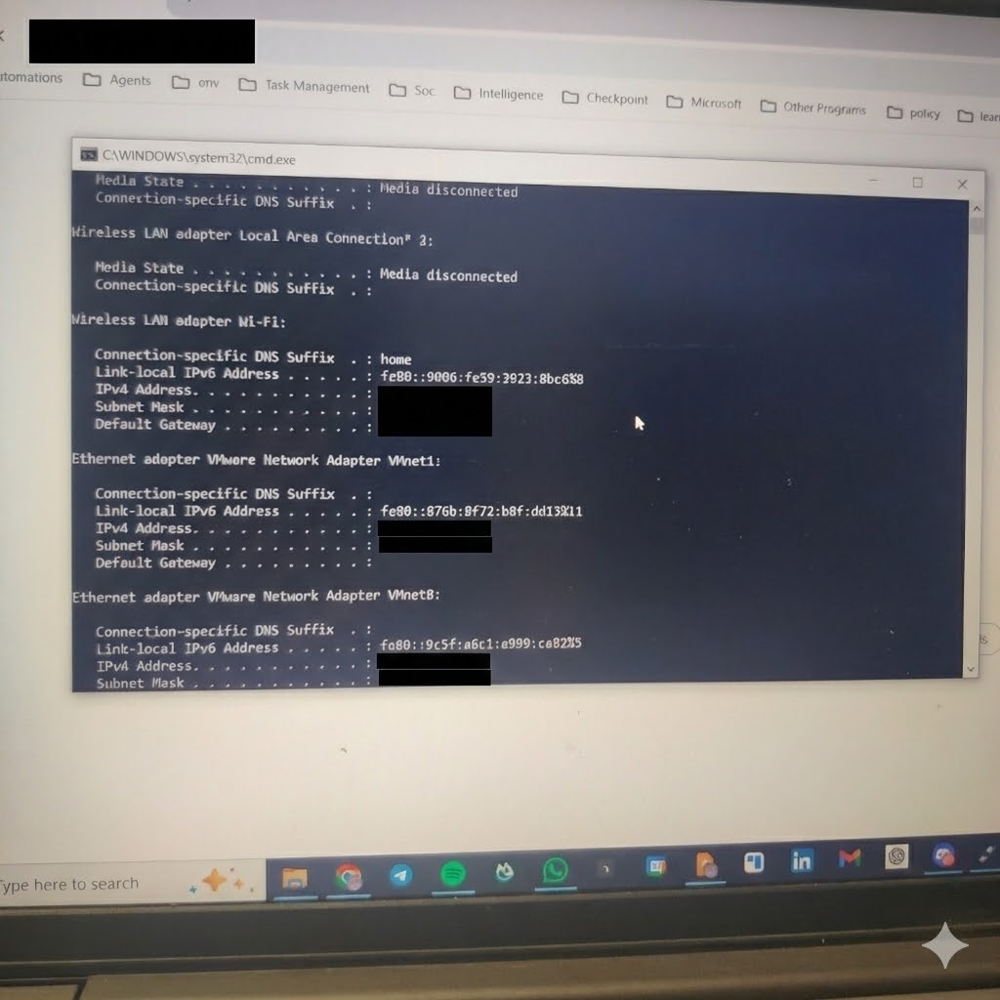

# 🏠 Chapter 1: Proxmox Install and Network Hell

This chapter documents the installation of Proxmox VE on my home lab server — a journey that taught me more about networking troubleshooting than I ever wanted to know. What should have been a simple install turned into a deep dive through BIOS settings, network interfaces, IP subnets, and DNS resolution.

## 🎯 Why Proxmox VE?

For this project, I chose Proxmox Virtual Environment (PVE) over a standard Linux bare-metal installation for three specific reasons:

1.  **Efficient Resource Usage (LXC):** I need to run tools like **n8n** and **PostgreSQL** efficiently. Proxmox LXC containers allow these to run with minimal overhead compared to full Virtual Machines.
2.  **Security & Isolation:** As a cybersecurity researcher, I need a sandbox environment. Proxmox allows me to spin up isolated VMs for testing vulnerability scanners or malware analysis and snapshot them instantly for recovery.
3.  **Hardware Passthrough:** The build includes an **NVIDIA RTX 2060**. Proxmox allows for IOMMU grouping, meaning I can pass the GPU directly to a VM for local LLM inference and RAG workflows.

---

## 💾 Part 1: Creating the Boot Media

To begin, I needed to transform a standard USB drive into a bootable Proxmox installer.

**Tools Used:**
* **Software:** [Rufus](https://rufus.ie/) (Windows)
* **Source:** Proxmox VE 8.x ISO

**The Process:**
1. Downloaded the official ISO from the Proxmox website
2. Launched Rufus and selected my hard drive
3. Burned the ISO using DD mode for maximum compatibility

**First Challenge:** Rufus didn't initially detect my USB device. I was using a USB hard drive instead of a USB stick, and Rufus filters these out by default. The solution was to enable "List USB Hard Drives" in the advanced drive properties.



---

## ⚙️ Part 2: BIOS Configuration

Before installing Proxmox, I connected a monitor and keyboard to the server and made crucial BIOS changes to enable virtualization features.

**Critical BIOS Settings:**

**VT-x (Intel Virtualization Technology):** Normally, the OS "believes" it's the exclusive owner of the CPU (Ring 0). VT-x is a set of CPU instructions that allows a Hypervisor (Proxmox) to create an "illusion" for virtual machines as if they have their own dedicated CPU, with complete isolation between them. Without this, virtualization would be painfully slow (relying on software emulation).

**VT-d (Virtualization for Directed I/O):** This is the game-changer for AI workloads. Normally, the Hypervisor mediates all hardware access. This means if a VM wants to render graphics, it asks the Hypervisor, which then communicates with the GPU — too slow for Deep Learning. VT-d enables IOMMU (Input-Output Memory Management Unit) for DMA Remapping. This allows us to take the physical address of the RTX 2060 and map it directly into the Linux VM's memory space. The VM "sees" the card as if it's physically connected, with no intermediary.

**Secure Boot:** This security mechanism verifies the cryptographic signature of the bootloader before executing it (to prevent boot-level rootkits). The problem is that the keys burned into consumer motherboards are Microsoft's. Proxmox's bootloader (based on open source) isn't always signed by Microsoft's key, so the board "blocks" it thinking it's malicious software. Disabling Secure Boot allows us to run code not signed by Microsoft.


---

## 📀 Part 3: The Installation Process

With the BIOS configured, I was ready to install Proxmox. I booted from the Hard drive, but getting to the boot menu took several attempts — pressing Del, F11, F7 didn't work initially. I had to enter the BIOS and manually select the boot menu option.

Finally, the Proxmox installation wizard appeared:


**Installation Configuration:**
* **Target Disk:** Internal NVMe Drive (wiped clean)
* **Filesystem:** ext4 (standard choice)
* **Management Interface:** nic0 (onboard ethernet)
* **IP Address:** 192.168.100.200/24 (initial configuration)
* **Gateway:** 192.168.100.1
* **DNS Server:** 8.8.8.8 (Google DNS)
* **Hostname:** pve.local

**Important Note:** I initially had the server connected to a docking station's ethernet port, which the installer detected as `nic1`. I later moved the cable to the onboard port (`nic0`) to avoid issues.

The installation completed successfully, and the server rebooted!

---

## 🔧 Part 4: Network Troubleshooting Hell

The installation completed, but when I tried to access the web interface from my laptop at `https://192.168.100.200:8006`, it didn't work. Thus began my journey through three layers of networking issues.

### Issue #1: Physical Interface Mismatch

The first problem was that the network interface wasn't actually up and running. I SSH'd into the server and ran:

```bash
ip a
```

The output revealed the issue:



**The Problem:** 
- The configuration file specified `nic0` (onboard ethernet) as the bridge interface
- But `nic1` (docking station ethernet) showed as `UP` (active)
- Meanwhile `nic0` was `DOWN` (inactive)

**The Diagnosis:** The ethernet cable was still connected to the docking station port (nic1), but Proxmox was configured to use the onboard port (nic0).

**The Solution:** I physically moved the ethernet cable from the docking station to the onboard ethernet port on the motherboard.



After reconnecting the cable to the correct port, `nic0` came up successfully!

### Issue #2: IP Subnet Mismatch

Even with the correct interface up, I still couldn't reach the web UI from my laptop. Time to investigate the network configuration. I checked my laptop's IP configuration:

```cmd
ipconfig
```



**The Problem:** My laptop was on the `10.100.102.x` subnet (home Wi-Fi), but the Proxmox server was configured with `192.168.100.200` — completely different subnets! They couldn't communicate.

**The Solution:** I needed to reconfigure the server to match my home network's subnet. I edited the network interfaces file:

```bash
nano /etc/network/interfaces
```


**Key Changes Made:**
- **Old Address:** `192.168.100.200/24`
- **New Address:** `10.100.102.200/24`
- **Gateway:** `10.100.102.1` (home router)

**Saving in nano:**
1. Press `Ctrl+O` then `Enter` to save
2. Press `Ctrl+X` to exit

**Important Linux Filesystem Lesson:** The file `/etc/network/interfaces` is located in:
- `/` (Root): The top of the entire filesystem hierarchy
- `/etc/` (Etcetera/Editable Text Configuration): Contains all system-wide configuration files
- `/etc/network/`: Networking-specific configuration directory
- `/etc/network/interfaces`: The actual file that defines how network interfaces are configured at boot

After editing, I applied the changes:

```bash
ifreload -a
```

This reloaded the network configuration without requiring a full reboot. I verified the change:

```bash
ip a
```


Success! The server now had the correct IP address on the right subnet.

### Issue #3: DNS Resolution Failure

I tried accessing the web UI again: `https://10.100.102.200:8006`

It worked! I could see the Proxmox login screen. But when I tried to update the system, another problem appeared.

**The Problem:**
```bash
ping 8.8.8.8  # Success - Internet connectivity works
ping google.com  # Failure - Name resolution broken
```

The server could reach the internet by IP but couldn't resolve domain names.

**The Solution:** The DNS server configuration wasn't persisted correctly. I manually added Google's DNS:

```bash
nano /etc/resolv.conf
```

Added the line:
```
nameserver 8.8.8.8
```

Now domain name resolution worked! The web interface was fully accessible:


**Security Note:** The browser showed a "Your connection is not private" warning. This is expected because Proxmox uses a self-signed SSL certificate by default. I clicked "Advanced" → "Proceed" to access the interface.

**Login Credentials:**
- **User:** root
- **Password:** (set during installation)
- **Realm:** Linux PAM (default)

---

## ✨ Part 5: Post-Install Configuration

With the network finally stable and the web interface accessible, it was time to optimize the Proxmox installation using community scripts.

I ran the official Proxmox VE Post-Install script:

```bash
bash -c "$(wget -qLO - https://github.com/community-scripts/ProxmoxVE/raw/main/tools/pve/post-pve-install.sh)"
```

**Actions Performed by the Script:**
1. **Removed the "No Valid Subscription" nag screen** — This annoying popup appears on every login for non-enterprise users
2. **Disabled Enterprise Repositories** — These require a paid subscription
3. **Enabled No-Subscription (Free) Repositories** — Community-supported package sources
4. **Full System Update** — Ensured all packages were up to date

After running the script, Proxmox was fully configured and ready for production use!

---

## 🎓 Lessons Learned

This installation taught me several valuable lessons:

1. **Physical Layer Matters:** Always verify which physical ethernet port is being used. Configuration files and reality must match.

2. **IP Subnets Are Critical:** Devices on different subnets (192.168.x.x vs 10.x.x.x) cannot communicate without routing. Always check with `ipconfig` or `ip a`.

3. **DNS Is Often Forgotten:** Even with internet connectivity, services fail without proper name resolution. Always configure DNS servers explicitly.

4. **Linux File Hierarchy:** Understanding `/etc/` as the configuration hub is essential for system administration.

5. **BIOS Virtualization:** VT-x and VT-d must be enabled for any serious virtualization or GPU passthrough work.

---

## 🚀 Next Steps

With Proxmox installed and network configured, the next chapters will cover:

- [ ] Deploy Docker via LXC containers
- [ ] Set up n8n with PostgreSQL backend
- [ ] Configure NVIDIA GPU Passthrough for AI workloads
- [ ] Build the RAG Knowledge Base pipeline
- [ ] Implement security hardening and MFA

---

**Total Time:** ~4 hours (3.5 hours of troubleshooting networking!)  
**Difficulty:** ⭐⭐⭐☆☆ (Moderate — networking knowledge required)