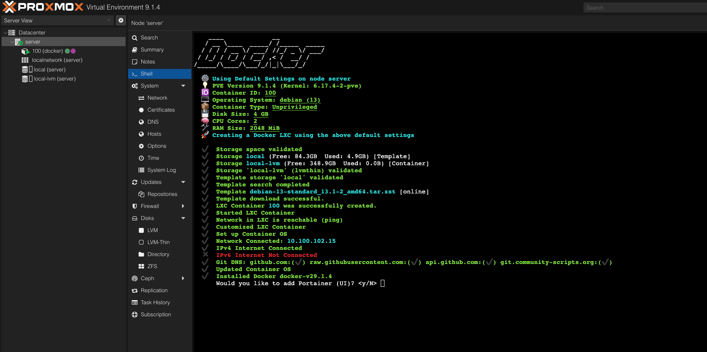
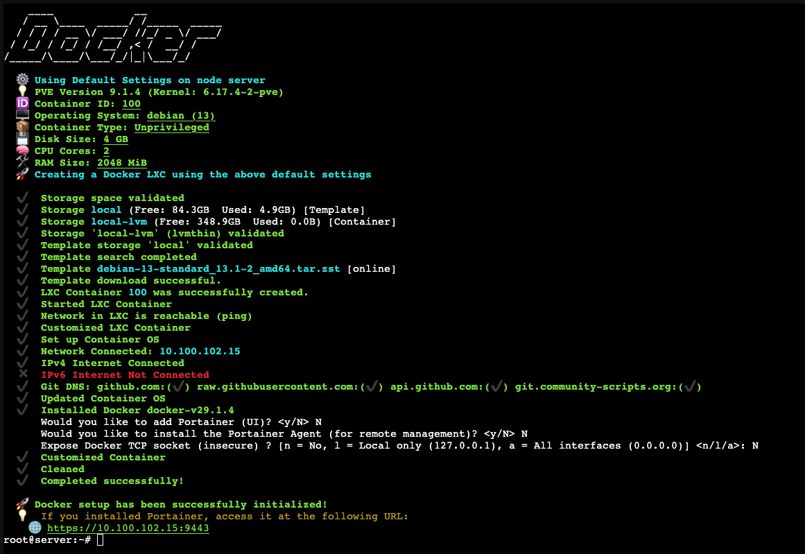
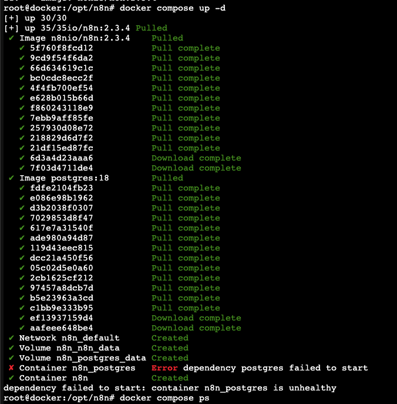
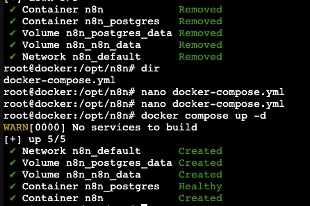
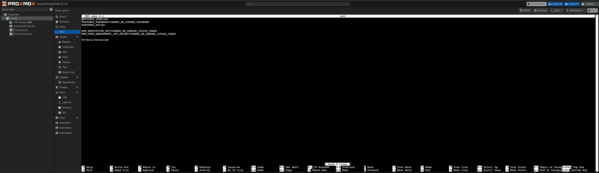
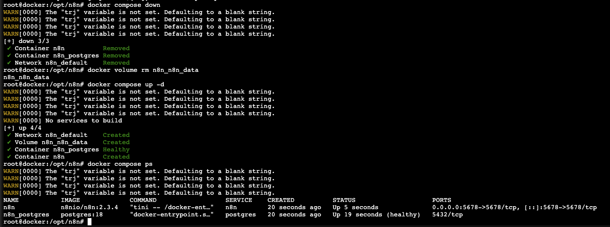
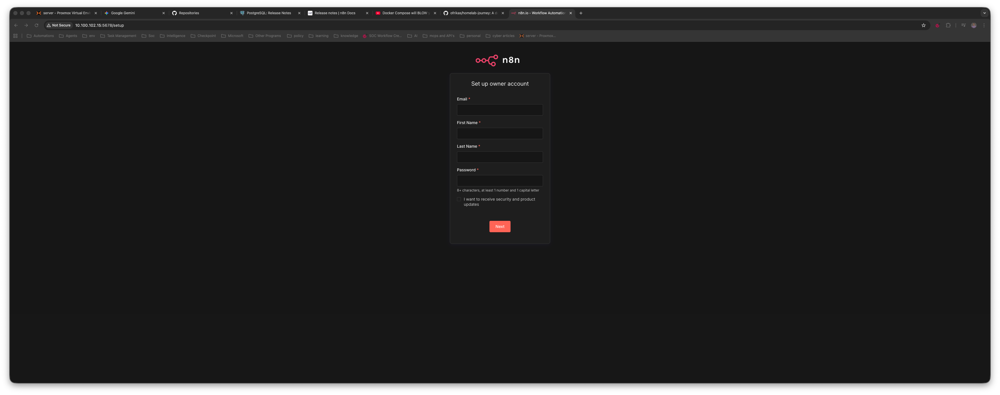
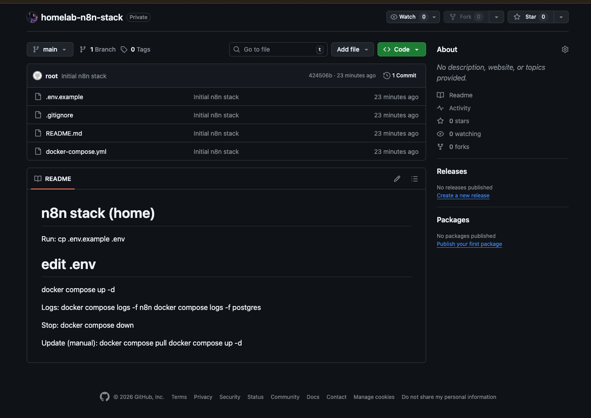

# 🏠 Chapter 2: Docker and n8n Setup

This chapter documents the deployment of Docker inside a Proxmox LXC container and setting up n8n with PostgreSQL as the database backend. What started as a straightforward container deployment turned into a crash course on Docker Compose, PostgreSQL volume quirks, and environment variable management.

## 🎯 Why Docker + n8n?

For my automation needs, I chose **n8n** — an open-source workflow automation platform similar to Zapier but fully self-hosted. Here's why:

1. **Full Control:** Self-hosted means no vendor lock-in, no API limits, and complete data ownership
2. **PostgreSQL Backend:** Unlike SQLite (n8n's default), PostgreSQL provides better performance, concurrent access, and proper backup/restore capabilities
3. **Docker Compose:** Declarative infrastructure — the entire stack is defined in code and can be versioned, replicated, and recovered

As a security automation engineer, having workflows that handle sensitive data on infrastructure I control is essential.

---

## 🐳 Part 1: Installing Docker via LXC

Rather than installing Docker manually, I used the same community scripts repository that helped with Proxmox setup in Chapter 1.

**The Command:**
```bash
bash -c "$(wget -qLO - https://github.com/community-scripts/ProxmoxVE/raw/main/ct/docker.sh)"
```

This script creates a new LXC container optimized for Docker workloads. During the installation, I was prompted with several options:



**Installation Decisions:**

| Prompt | My Choice | Reasoning |
|--------|-----------|-----------|
| Install Portainer? | No |It'w Web UI for Docker management — proxmox is doing it for us |
| Install Portainer Agent? | No | I'll connect directly via Proxmox, no need for remote management |
| Expose Docker TCP socket? | No | Security risk — I don't need external Docker API access |



**Verifying the Installation:**

I entered the container and verified everything was working:

```bash
pct enter 100
```

```bash
ip a | grep 10.100.102.15 || hostname -I
# Output: 10.100.102.15

docker --version
# Output: Docker version 29.1.4
```

Docker was installed and ready!

---

## 📦 Part 2: Creating the n8n Stack

This was my first Docker Compose file — I spent time researching best practices on the [n8n documentation](https://docs.n8n.io) and watching tutorials to understand the syntax.

**Creating the Project Directory:**
```bash
mkdir -p /opt/n8n && cd /opt/n8n
```

**The Docker Compose File:**

I created `docker-compose.yml` with two services: PostgreSQL as the database and n8n as the workflow engine. The full configuration is available at [configs/docker/n8n-stack/docker-compose.yml](../configs/docker/n8n-stack/docker-compose.yml).

Key design decisions:
- **PostgreSQL 18:** Latest stable version for security and features
- **n8n 2.3.4:** Pinned to a specific stable version, not `latest`
- **Health Checks:** PostgreSQL includes a health check so n8n waits until the database is ready
- **Environment Variables:** All secrets are externalized to a `.env` file (never hardcoded!)

**The Environment File (.env):**

```bash
POSTGRES_USER=n8n
POSTGRES_PASSWORD=CHANGE_ME
POSTGRES_DB=n8n
N8N_ENCRYPTION_KEY=CHANGE_ME
N8N_USER_MANAGEMENT_JWT_SECRET=CHANGE_ME
TZ=Asia/Jerusalem
```

See the template at [configs/docker/n8n-stack/secrets.template](../configs/docker/n8n-stack/secrets.template).

**First Launch Attempt:**
```bash
docker compose up -d
```



And... it failed. Time for troubleshooting!

---

## 🔧 Part 3: Troubleshooting PostgreSQL 18

The journey to a working n8n instance involved three separate issues. Each one taught me something important about Docker and PostgreSQL.

### Issue #1: PostgreSQL 18 Volume Path Change

**The Problem:**
```bash
docker compose ps
docker compose logs --tail=200 postgres
```

The logs revealed that PostgreSQL 18 changed its internal data directory structure. When mounting a volume to `/var/lib/postgresql/data` (the traditional path), PostgreSQL 18 detected an incompatible structure and refused to start.

**The Solution:**
Mount the volume to `/var/lib/postgresql` instead of `/var/lib/postgresql/data`:

```yaml
volumes:
  - postgres_data:/var/lib/postgresql  # NOT /var/lib/postgresql/data
```

Clean up and restart:
```bash
docker compose down -v
docker compose up -d
```



### Issue #2: Weak Default Passwords

After PostgreSQL started, I realized the `.env` file still had `CHANGE_ME` placeholder values. This is a security risk — anyone with access to backups or the file could compromise the system.

**The Solution:**
Generate strong random values:

```bash
# Generate secure random strings
openssl rand -hex 32  # For encryption keys
openssl rand -base64 24  # For passwords
```



**Important:** Avoid special characters like `$`, `!`, `"` in passwords — they can cause shell escaping issues in Docker environment variables.

After updating `.env`:
```bash
docker compose down -v
docker compose up -d
```

### Issue #3: Encryption Key Mismatch

**The Problem:**
After changing the encryption key, n8n refused to start:

```bash
curl -sS -o /dev/null -w "%{http_code}\n" http://127.0.0.1:5678/
# Output: 000 (connection refused)

docker compose logs --tail=200 n8n
# Error: Mismatching encryption keys
```



n8n had already created its configuration with the old encryption key. When I changed the key in `.env`, it no longer matched.

**The Solution:**
Since this was a fresh installation with no important data, I removed the n8n volume:

```bash
docker compose down
docker volume rm n8n_n8n_data
docker compose up -d
```

### Issue #4: PostgreSQL Password Mismatch

**The Problem:**
Even after the previous fixes, n8n couldn't connect to PostgreSQL:

```
FATAL: password authentication failed for user "n8n"
```

This happened because PostgreSQL stores the password **only during first initialization**. Changing `POSTGRES_PASSWORD` in `.env` after the database was created doesn't update the actual password inside the database.

**The Solution:**
Remove the PostgreSQL volume to reinitialize:

```bash
docker compose down
docker volume rm n8n_postgres_data
nano .env  # Verify password has no problematic characters
docker compose up -d
```

**Final Verification:**
```bash
docker compose ps
curl -I http://127.0.0.1:5678/ | head -n 1
# HTTP/1.1 200 OK
```

Success! Navigating to `http://10.100.102.15:5678`:



---

## ✅ Part 4: Securing the Environment

With n8n running, I documented best practices for secrets management:

**Do:**
- Use strong, randomly generated passwords (32+ characters)
- Keep `.env` files out of version control (add to `.gitignore`)
- Use `openssl rand` to generate cryptographic keys
- Pin Docker image versions (e.g., `postgres:18`, not `postgres:latest`)

**Don't:**
- Use placeholder values like `CHANGE_ME` in production
- Include special shell characters (`$`, `!`, `` ` ``) in environment variables
- Commit secrets to Git
- Change encryption keys after n8n has stored credentials

---

## 📤 Part 5: Version Control with GitHub

To manage my n8n stack configuration, I set up a Git repository for Infrastructure as Code.

**Creating the Repository Structure:**
```bash
mkdir -p /opt/repos/n8n-stack
cd /opt/repos/n8n-stack
cp /opt/n8n/docker-compose.yml .
```

**Creating Supporting Files:**
```bash
# .env.example (safe to commit)
cat > .env.example << 'EOF'
POSTGRES_USER=n8n
POSTGRES_PASSWORD=REPLACE_ME
POSTGRES_DB=n8n
N8N_ENCRYPTION_KEY=REPLACE_ME
N8N_USER_MANAGEMENT_JWT_SECRET=REPLACE_ME
TZ=Asia/Jerusalem
EOF

# .gitignore
cat > .gitignore << 'EOF'
.env
*.log
EOF

# README.md
cat > README.md << 'EOF'
# n8n Stack (Home Lab)

## Quick Start
cp .env.example .env
# Edit .env with secure values
docker compose up -d

## Commands
docker compose logs -f n8n     # View logs
docker compose ps              # Check status
docker compose down            # Stop
docker compose pull && docker compose up -d  # Update
EOF
```

**Setting Up Git:**
```bash
apt update && apt install -y git
git init
git add .
git commit -m "Initial n8n stack"
```

**Configuring SSH Authentication:**
```bash
ssh-keygen -t ed25519 -C "n8n-stack" -f ~/.ssh/id_ed25519 -N ""
cat ~/.ssh/id_ed25519.pub
# Copy output and add to GitHub → Settings → SSH Keys
```

**Pushing to GitHub:**
```bash
# First attempt failed — repository didn't exist yet
git remote add origin git@github.com:ofrikas/homelab-n8n-stack.git
git push -u origin main
# ERROR: Repository not found

# After creating the repo on GitHub (with a README):
git push -u origin main --force  # Override remote README
```



**What's NOT in Git (and shouldn't be):**
- Actual `.env` file with real secrets
- PostgreSQL data (credentials, users, execution history)
- n8n binary data and encrypted credentials
- These will be backed up separately on the Proxmox server

---

## 🎓 Lessons Learned

1. **PostgreSQL Version Changes Matter:** Major version upgrades can change internal paths. Always check release notes when using new major versions.

2. **Environment Variables Are Tricky:** Special characters cause escaping issues. Generate clean alphanumeric secrets.

3. **Order of Operations:** PostgreSQL initializes passwords once. Plan your secrets before first launch, or be prepared to wipe volumes.

4. **Encryption Keys Are Critical:** n8n's encryption key cannot be changed after credentials are stored. Document and backup this key securely!

5. **Infrastructure as Code:** Even a simple Docker Compose file benefits from version control. It documents what was deployed and enables recovery.

---

## 🚀 Next Steps

With Docker and n8n operational, the next chapter will cover:

- [x] Domain registration and DNS setup
- [x] Cloudflare Tunnel for secure exposure
- [x] Exposing n8n securely to the internet
- [ ] Security hardening and MFA

**Continue to:** [Chapter 3: Domain, Cloudflare, and Exposing n8n](03-networking-and-firewall-basics.md)

---

**Total Time:** ~3 hours (including troubleshooting)  
**Difficulty:** ⭐⭐⭐☆☆ (Moderate — Docker knowledge helpful)
