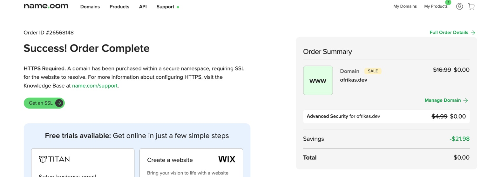
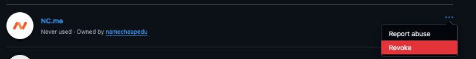
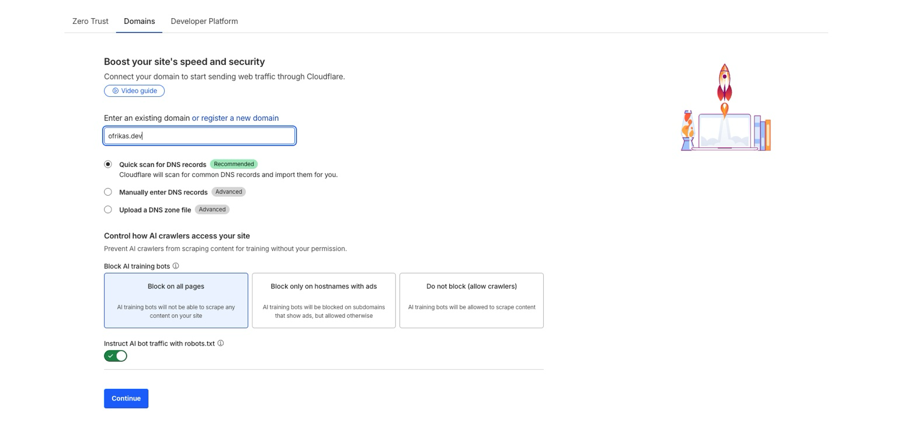
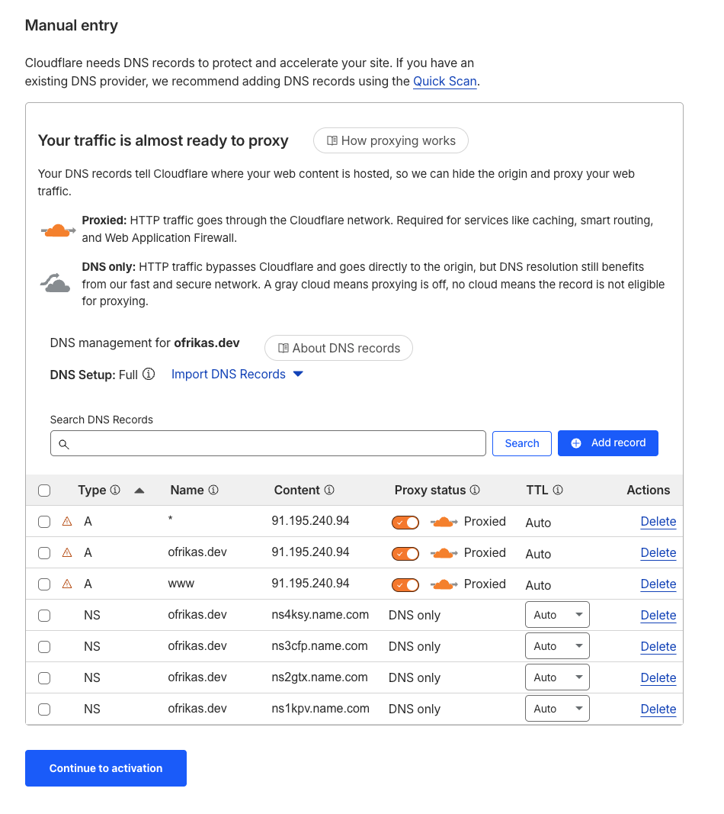
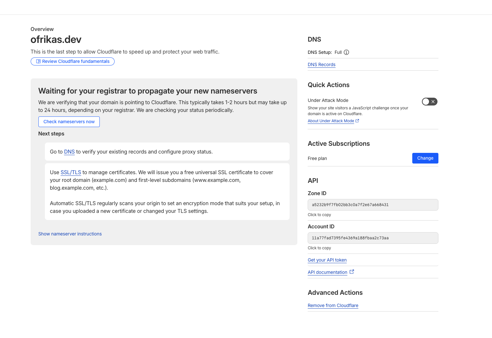
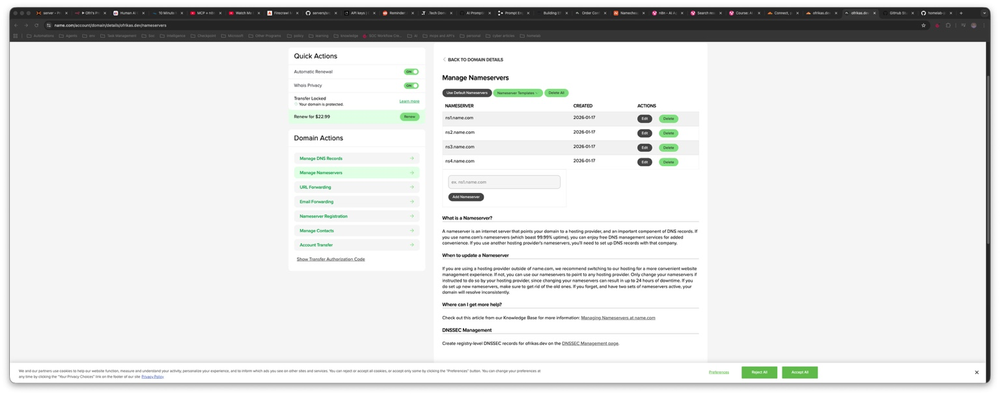
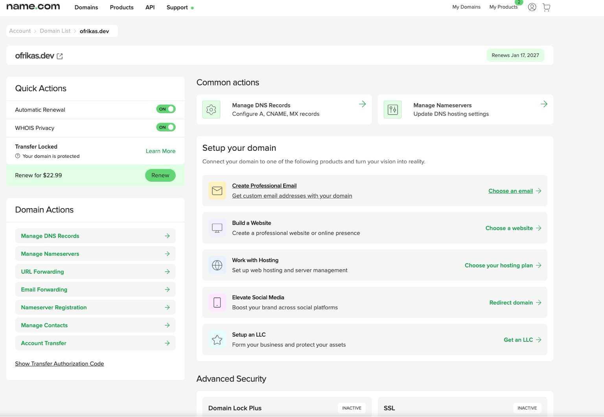

# 🏠 Chapter 3: Domain, Cloudflare, and Exposing n8n to the Internet

Now it's time to put the homelab to work! My first real project is an AI agent called **"Ofri's Proxy"** — a personal assistant that people can ask about my CV, GitHub projects, or anything related to me. It will answer using data I provide. I'll use the n8n instance we set up in Chapter 2 to build this.

But first — I need a way for the internet to reach my homelab. That means: a domain, DNS, and a secure tunnel.

---

## 🎯 Why Not Just Expose My IP?

Before diving in, I considered just pointing a domain directly to my home IP address. But that approach has problems:

- **Security Risk:** My home IP would be public, making it a target
- **SSL Certificates:** I'd need to manage Let's Encrypt renewals myself
- **Dynamic IP:** Home IPs can change, breaking everything
- **DDoS Protection:** None — anyone could hammer my connection

**Solution:** Use Cloudflare as a reverse proxy. They handle SSL, hide my IP, and provide DDoS protection — all for free.

---

## 🌐 Part 1: Getting a Domain

First, I needed a domain name. As a formally student, I discovered I could use my GitHub Student Developer Pack to get a free domain for one year!

**My Recommendation:** [name.com](https://www.name.com/) — simple interface, works well with the GitHub student offer.



**Security Note:** After the domain purchase, I went to my GitHub settings and revoked the domain provider's access to my GitHub account. They had requested read/write access to my repositories — completely unnecessary for domain management!



**Lesson learned:** Always review OAuth permissions after using "Sign in with GitHub" and revoke anything unnecessary.

---

## ☁️ Part 2: Setting Up Cloudflare

With the domain in hand, I signed up for Cloudflare and added my domain.



I chose the **free plan** — it includes everything I need: DNS management, SSL, and tunnels.

### The DNS Import Problem

When I added my domain, Cloudflare did a "Quick Scan" and found old DNS records from name.com:



These were leftover A records pointing to name.com's parking page — I deleted all of them to start fresh:



### Switching Nameservers

The key step: telling name.com to let Cloudflare handle DNS. I replaced name.com's nameservers with Cloudflare's:

**Before (name.com's default nameservers):**



**After:** Replaced with Cloudflare's nameservers (shown in the Cloudflare dashboard)



### Understanding the Flow

Here's what changed:

| Component | Role |
|-----------|------|
| **name.com** | Domain ownership (registrar) |
| **Cloudflare** | DNS control + security layer |
| **Nameservers** | Tell the internet who controls DNS |
| **DNS Records** | Tell traffic where to go |
| **Tunnel** | How traffic reaches my server without exposing my IP |

**Before:** `Internet → name.com DNS → My IP`  
**After:** `Internet → Cloudflare → Tunnel → My Server`

---

## 🚇 Part 3: Creating the Cloudflare Tunnel

This is the magic part. Cloudflare Tunnels let me expose services without opening any ports on my router or revealing my home IP.

### How It Works

1. A small `cloudflared` container runs in my homelab
2. It creates an **outbound** connection to Cloudflare (no inbound ports needed!)
3. Cloudflare routes traffic through this tunnel
4. My services receive requests without being directly exposed

### Setting Up the Tunnel

In the Cloudflare Zero Trust dashboard, I created a new tunnel and got a token. Then I ran the tunnel container:

```bash
docker run -d \
  --name cloudflared \
  --restart unless-stopped \
  --network n8n_default \
  cloudflare/cloudflared:latest \
  tunnel --no-autoupdate run --token <YOUR_TUNNEL_TOKEN>
```

**Key flags explained:**
- `--network n8n_default` — Joins the same Docker network as n8n, so they can communicate
- `--restart unless-stopped` — Auto-restart on crashes or reboots
- `--no-autoupdate` — I prefer to control updates manually

### Verifying the Setup

```bash
docker ps --format "table {{.Names}}\t{{.Image}}\t{{.Ports}}"
docker network ls
```

### Configuring the Route

In Cloudflare's dashboard, I added a public hostname:
- **Subdomain:** `agents`
- **Domain:** `ofrikas.dev`
- **Service:** `http://n8n:5678`

That's it. No nginx config. No SSL setup. No port forwarding.

**Security Note:** I also updated the n8n port binding in docker-compose.yml from `5678:5678` to `127.0.0.1:5678:5678`. This ensures n8n is only accessible from localhost and through the Cloudflare tunnel — not directly from the network.

---

## ✨ Part 4: The "Wait, That's It?" Moment

I navigated to `https://agents.ofrikas.dev` and... it just worked.


This felt strange. I expected to configure something in n8n, or set up certificates, or edit Docker configs. But I did none of that.

**What I actually did:**
1. Ran the tunnel container with the token
2. Added a routing rule in Cloudflare's dashboard
3. That's literally it

### The Architecture

```
Internet
    ↓
https://agents.ofrikas.dev
    ↓
Cloudflare (DNS + TLS + DDoS protection)
    ↓
Cloudflare Tunnel (encrypted)
    ↓
Docker network (n8n_default)
    ↓
n8n container (port 5678)
```

**This is how good infrastructure should work:** configuration changes, not code changes. The tunnel container doesn't know or care what services exist. Cloudflare doesn't know or care what's running in my homelab. Each component does one job well.

---

## 🎓 Lessons Learned

1. **Cloudflare Tunnels are magic:** No port forwarding, no exposed IP, free SSL, automatic certificate renewal. This should be the default for any homelab.

2. **Always audit OAuth permissions:** Domain providers don't need access to your code repositories. Revoke unnecessary access immediately.

3. **Nameservers vs DNS records:** The registrar (name.com) controls ownership. Whoever controls the nameservers controls where traffic goes. These are separate concepts.

4. **Docker networks matter:** The tunnel container needs to be on the same network as the services it exposes. `--network n8n_default` was the key.

5. **Security through architecture:** By using tunnels, I never had to think about firewalls, SSL, or IP exposure. The secure path is the only path.

---

## 🚀 Next Steps

With n8n accessible from the internet, the next chapter will cover:

- [ ] Firewall rules and network segmentation
- [ ] Fail2ban and intrusion detection
- [ ] Two-factor authentication for Proxmox
- [ ] Security hardening best practices

**Continue to:** [Chapter 4: Security Hardening and MFA](04-security-hardening-and-mfa.md)

---

**Total Time:** ~4 hours  
**Difficulty:** ⭐⭐☆☆☆ (Easy — Cloudflare makes this surprisingly simple)
